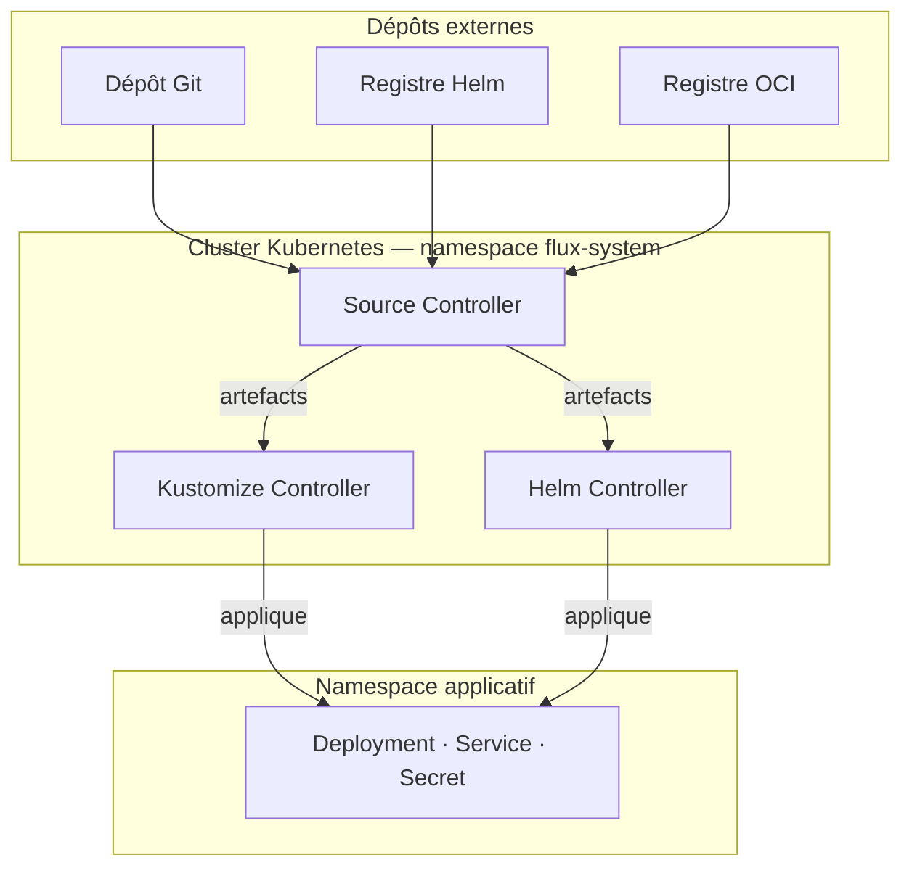
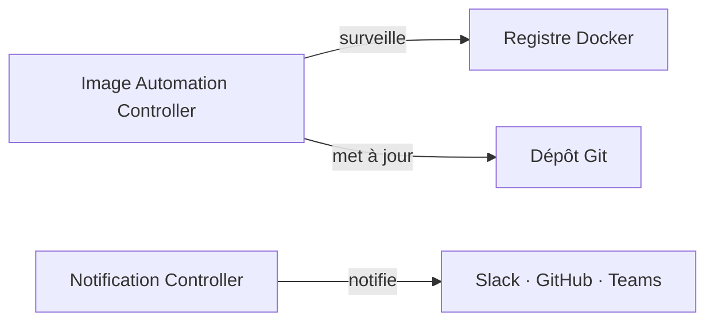
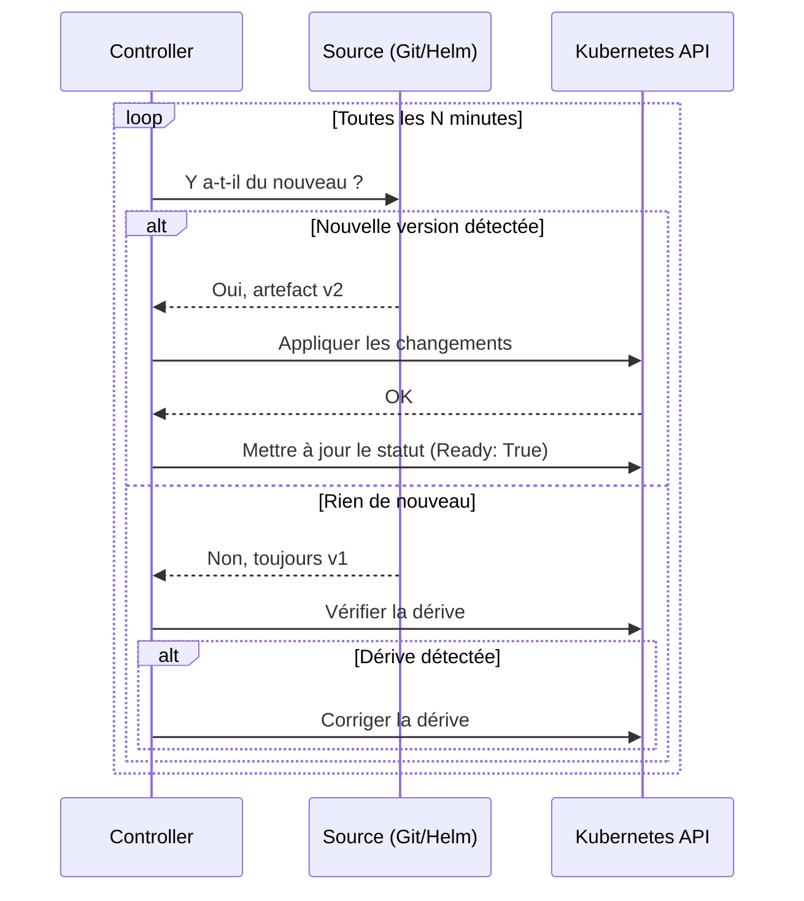

FluxCD n'est pas un seul programme monolithique. C'est un ensemble de **controllers Kubernetes spécialisés**, chacun responsable d'un domaine précis. Comprendre leur rôle respectif permet de mieux lire les erreurs, de déboguer efficacement, et d'anticiper comment une configuration va se comporter.

## Vue d'ensemble

### Flux principal



Le Source Controller surveille en continu les dépôts externes et produit des artefacts locaux. Le Kustomize Controller et le Helm Controller consomment ces artefacts pour déployer les ressources dans le cluster.

### Flux complémentaires



L'Image Automation Controller surveille un registre Docker et met automatiquement à jour le dépôt Git quand une nouvelle image est publiée. Le Notification Controller achemine les événements Flux vers les outils externes.

## Source Controller

Le Source Controller est la **porte d'entrée** de FluxCD vers le monde extérieur. Son seul rôle est de surveiller des sources et de les télécharger sous forme d'artefacts locaux.

Il gère quatre types de sources :

| Ressource        | Source surveillée                                |
| ---------------- | ------------------------------------------------ |
| `GitRepository`  | Un dépôt Git (GitHub, GitLab, Gitea…)            |
| `HelmRepository` | Un registre de charts Helm (HTTP ou OCI)         |
| `HelmChart`      | Un chart Helm spécifique dans un HelmRepository  |
| `OCIRepository`  | Une image OCI contenant des manifests Kubernetes |

Quand une nouvelle version est détectée (nouveau commit, nouveau tag, nouvelle version de chart), le Source Controller télécharge l'artefact et le met à disposition des autres controllers via un artifact local.

```yaml
---
apiVersion: source.toolkit.fluxcd.io/v1
kind: GitRepository
metadata:
  name: gitops-fleet
  namespace: flux-system
spec:
  interval: 1m # fréquence de vérification
  url: https://github.com/monorg/gitops-fleet
  ref:
    branch: main
```

## Kustomize Controller

Le Kustomize Controller consomme les artefacts produits par le Source Controller et les **applique dans le cluster**. Malgré son nom, il ne nécessite pas obligatoirement l'utilisation de Kustomize — il peut appliquer des manifests Kubernetes bruts.

Sa ressource principale est la `Kustomization` (attention : ce n'est pas la même que `kustomize.config.k8s.io/v1beta1/Kustomization` de l'outil `kustomize` — c'est une ressource FluxCD).

```yaml
---
apiVersion: kustomize.toolkit.fluxcd.io/v1
kind: Kustomization
metadata:
  name: apps
  namespace: flux-system
spec:
  interval: 10m
  sourceRef:
    kind: GitRepository
    name: gitops-fleet
  path: ./apps/staging # chemin dans le dépôt Git
  prune: true # supprime les ressources retirées du dépôt
  wait: true # attend que les ressources soient prêtes
```

Le champ `prune: true` est important : si vous supprimez un fichier du dépôt Git, FluxCD supprime la ressource correspondante dans le cluster. Le dépôt Git est bien la source de vérité absolue.

## Helm Controller

Le Helm Controller gère le cycle de vie des **releases Helm**. Il utilise lui aussi les artefacts du Source Controller, mais au lieu d'appliquer des manifests bruts, il exécute les opérations Helm (install, upgrade, rollback).

```yaml
---
apiVersion: helm.toolkit.fluxcd.io/v2
kind: HelmRelease
metadata:
  name: podinfo
  namespace: podinfo
spec:
  interval: 10m
  chart:
    spec:
      chart: podinfo
      version: ">=6.0.0"
      sourceRef:
        kind: HelmRepository
        name: podinfo
  values:
    ui:
      color: "#4287f5"
```

Le Helm Controller gère automatiquement les upgrades quand une nouvelle version de chart est disponible, selon la contrainte de version définie.

## Notification Controller

Le Notification Controller gère **les alertes et les webhooks**. Il peut envoyer des notifications vers Slack, Teams, GitHub, GitLab, PagerDuty, et bien d'autres, quand des événements se produisent dans FluxCD (déploiement réussi, échec de réconciliation, etc.).

Il peut aussi recevoir des webhooks entrants (par exemple, de GitHub) pour déclencher une réconciliation immédiate au lieu d'attendre l'intervalle de polling.

## Image Automation Controller

Ce controller est une extension avancée de FluxCD. Il surveille les **registres Docker** pour détecter de nouvelles images, et met automatiquement à jour les manifests dans le dépôt Git quand une nouvelle image correspondant à une politique est disponible.

C'est ce qui permet de dire : "dès qu'une nouvelle version stable de podinfo est publiée, mets à jour mon dépôt Git automatiquement." On couvre ce controller en détail dans la Partie 5.

## Le cycle de réconciliation

Chaque controller fonctionne selon la même boucle :



Le champ `interval` sur chaque ressource FluxCD contrôle la fréquence de cette boucle. Une valeur de `1m` sur un `GitRepository` ne signifie pas que FluxCD poll GitHub toutes les minutes en permanence — il vérifie si le digest du dépôt a changé, ce qui est une opération légère.

## Les CRDs en un coup d'œil

Voici les ressources custom que FluxCD installe dans votre cluster, par groupe :

| Groupe API                               | Ressources                                                      |
| ---------------------------------------- | --------------------------------------------------------------- |
| `source.toolkit.fluxcd.io/v1`            | `GitRepository`, `HelmRepository`, `HelmChart`, `OCIRepository` |
| `kustomize.toolkit.fluxcd.io/v1`         | `Kustomization`                                                 |
| `helm.toolkit.fluxcd.io/v2`              | `HelmRelease`                                                   |
| `notification.toolkit.fluxcd.io/v1beta3` | `Alert`, `Provider`, `Receiver`                                 |
| `image.toolkit.fluxcd.io/v1beta2`        | `ImageRepository`, `ImagePolicy`, `ImageUpdateAutomation`       |

Vous verrez ces groupes d'API dans les manifests tout au long du guide. Le chapitre suivant installe FluxCD et vous permet de les voir en action.
