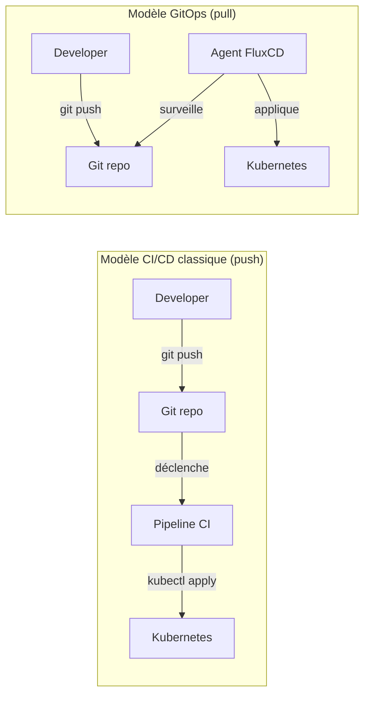

GitOps est une façon d'opérer des infrastructures et des applications en utilisant Git comme unique source de vérité. Ce chapitre pose les bases conceptuelles avant d'entrer dans le vif du sujet avec FluxCD.

## Le problème avant GitOps

Imaginez un pipeline CI/CD classique. Le code est testé, l'image Docker est construite, puis le pipeline **pousse** le déploiement vers Kubernetes :

```bash
# Ce que font la plupart des pipelines CI/CD
kubectl apply -f deployment.yaml
kubectl set image deployment/app app=myimage:v2
```

Ce modèle crée plusieurs problèmes en production.

**La dérive de configuration.** Quelqu'un se connecte au cluster en urgence et modifie une ressource à la main. Le pipeline ne le sait pas. L'état réel du cluster diverge de ce qui est décrit dans les fichiers. Au bout de quelques semaines, personne ne sait vraiment ce qui tourne en production.

**L'absence d'auditabilité.** Qui a déployé quoi, quand, et pourquoi ? Les logs CI donnent une partie de la réponse, mais pas toujours avec le contexte complet.

**Le couplage entre CI et déploiement.** Le serveur CI a besoin d'accès en écriture au cluster Kubernetes. Cet accès est une surface d'attaque et un point de fragilité.

**Le rollback difficile.** Pour revenir en arrière, il faut rejouer un pipeline ou exécuter des commandes manuelles. Il n'y a pas de mécanisme naturel de retour à un état précédent.

## La solution GitOps

GitOps retourne le modèle. Au lieu de pousser les changements vers le cluster, un agent **dans** le cluster surveille un dépôt Git et **tire** les changements pour les appliquer.



Git devient la source de vérité absolue. L'état décrit dans Git **est** l'état attendu du cluster. L'agent s'assure en permanence que les deux sont identiques.

## Les 4 principes OpenGitOps

[OpenGitOps](https://opengitops.dev/) est la spécification officielle qui formalise ce que signifie "faire du GitOps". Elle définit quatre principes.

### 1. Déclaratif

Le système désiré est exprimé **déclarativement** : on décrit ce qu'on veut, pas comment y arriver. C'est exactement ce que font les manifests Kubernetes — un `Deployment` décrit le résultat attendu, pas la séquence de commandes pour l'obtenir.

### 2. Versionné et immuable

L'état désiré est **versionné** dans Git. Chaque changement est un commit. L'historique complet est conservé, avec qui a fait quoi et quand. On peut revenir à n'importe quel état antérieur simplement en pointant vers un commit précédent.

### 3. Récupération automatique

Si quelqu'un modifie manuellement une ressource dans le cluster (par exemple avec `kubectl edit`), l'agent le **détecte et le corrige automatiquement** pour revenir à l'état décrit dans Git. La dérive est impossible sur la durée.

### 4. Réconciliation continue

L'agent ne se contente pas d'appliquer les changements une fois. Il **réconcilie en permanence** l'état réel et l'état désiré, en boucle. S'il y a une différence, il la corrige.

## GitOps vs CI/CD push : le comparatif

| Aspect                  | CI/CD push                            | GitOps pull                      |
| ----------------------- | ------------------------------------- | -------------------------------- |
| Accès cluster depuis CI | Requis (credentials dans le pipeline) | Non requis                       |
| Source de vérité        | Partielle (Git + état cluster)        | Git uniquement                   |
| Dérive de config        | Possible et invisible                 | Détectée et corrigée             |
| Rollback                | Manuel (rejouer un pipeline)          | `git revert` + push              |
| Audit trail             | Logs CI                               | Historique Git                   |
| Observabilité de l'état | Dépend de l'outillage                 | Native (état Git = état cluster) |

## Qu'est-ce que FluxCD ?

FluxCD est un ensemble d'outils qui implémente GitOps pour Kubernetes. Il s'installe dans votre cluster sous forme de controllers Kubernetes et surveille en permanence vos dépôts Git (et registres Helm) pour réconcilier l'état du cluster avec l'état décrit dans Git.

FluxCD est un projet CNCF (Cloud Native Computing Foundation) au niveau "Graduated", ce qui signifie qu'il est considéré comme mature et prêt pour la production.

Le chapitre suivant détaille son architecture interne avant de passer à l'installation.
