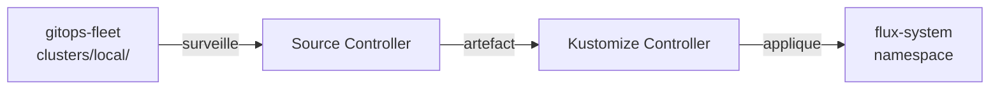

Ce chapitre installe tout ce dont vous avez besoin pour suivre ce guide : un cluster Kubernetes local avec k3d, et FluxCD bootstrappé sur un dépôt Git que vous contrôlez. À la fin, FluxCD surveille votre dépôt et est prêt à déployer des applications.

## Prérequis

Vérifiez que les outils suivants sont installés avant de commencer.

**Docker** — moteur de conteneurs requis par k3d.

```bash
docker --version
# Docker version 27.x ou supérieur
```

**k3d** — crée des clusters Kubernetes légers dans Docker.

```bash
# Installation (Linux/macOS)
curl -s https://raw.githubusercontent.com/k3d-io/k3d/main/install.sh | bash

k3d version
# v5.x ou supérieur
```

**kubectl** — client Kubernetes en ligne de commande.

```bash
# Vérification
kubectl version --client
# Client Version: v1.32.x ou supérieur
```

**flux CLI** — interface en ligne de commande pour FluxCD.

```bash
# Installation (Linux/macOS)
curl -s https://fluxcd.io/install.sh | sudo bash

flux version
# flux: v2.x ou supérieur
```

**git** et un compte **GitHub** avec un token d'accès personnel.

Le token GitHub doit avoir les permissions `repo` (accès aux dépôts privés). Créez-le sur [github.com/settings/tokens](https://github.com/settings/tokens) et exportez-le :

```bash
export GITHUB_TOKEN=ghp_votretoken
export GITHUB_USER=votre-username
```

## Créer le cluster k3d

Créez un cluster local nommé `flux-cluster` :

```bash
k3d cluster create flux-cluster \
  --servers 1 \
  --agents 2 \
  --wait
```

Vérifiez qu'il est opérationnel :

```bash
kubectl get nodes
# NAME                        STATUS   ROLES
# k3d-flux-cluster-server-0   Ready    control-plane,master
# k3d-flux-cluster-agent-0    Ready    <none>
# k3d-flux-cluster-agent-1    Ready    <none>
```

## Créer le dépôt GitOps

Ce dépôt Git sera votre **source de vérité**. FluxCD le surveille et applique tout ce qu'il contient dans votre cluster. Nommez-le `gitops-fleet`.

Créez-le sur GitHub (public ou privé, au choix) :

```bash
gh repo create $GITHUB_USER/gitops-fleet \
  --private \
  --description "Dépôt GitOps — géré par FluxCD"
```

Ou créez-le manuellement depuis l'interface GitHub, puis clonez-le :

```bash
git clone https://github.com/$GITHUB_USER/gitops-fleet
cd gitops-fleet
```

## Vérifier les prérequis FluxCD

Avant de lancer le bootstrap, vérifiez que votre cluster est compatible :

```bash
flux check --pre
```

Vous devez voir :

```
► checking prerequisites
✔ Kubernetes 1.32.x >=1.28.0-0
✔ prerequisites checks passed
```

Si des vérifications échouent, corrigez-les avant de continuer.

## Bootstrapper FluxCD

Le bootstrap est l'étape clé : `flux` installe FluxCD dans votre cluster **et** configure votre dépôt `gitops-fleet` pour qu'il soit la source de vérité. À partir de là, FluxCD se gère lui-même via GitOps.

```bash
flux bootstrap github \
  --owner=$GITHUB_USER \
  --repository=gitops-fleet \
  --branch=main \
  --path=clusters/local \
  --personal
```

Ce que fait cette commande :

1. Installe les controllers FluxCD dans le namespace `flux-system`
2. Génère une paire de clés SSH et la dépose dans votre dépôt GitHub
3. Crée les fichiers de configuration FluxCD dans `clusters/local/flux-system/`
4. Crée un `GitRepository` qui pointe vers `gitops-fleet`
5. Crée une `Kustomization` qui surveille le chemin `clusters/local/`

Le bootstrap peut prendre une à deux minutes. Vous verrez des lignes de progression :

```
► connecting to github.com
✔ repository "gitops-fleet" created
► cloning branch "main" from Git repository
✔ cloned repository
► generating component manifests
✔ generated component manifests
✔ committed component manifests to "main" ("clusters/local/flux-system/")
► pushing component manifests to "gitops-fleet"
✔ installed components
✔ reconciled components
✔ bootstrap finished
```

## Vérifier l'installation

Vérifiez que tous les controllers sont prêts :

```bash
flux check
```

```
► checking prerequisites
✔ Kubernetes 1.32.x >=1.28.0-0
► checking controllers
✔ helm-controller: deployment ready
✔ kustomize-controller: deployment ready
✔ notification-controller: deployment ready
✔ source-controller: deployment ready
► checking crds
✔ alerts.notification.toolkit.fluxcd.io/v1beta3
✔ gitrepositories.source.toolkit.fluxcd.io/v1
✔ helmreleases.helm.toolkit.fluxcd.io/v2
✔ kustomizations.kustomize.toolkit.fluxcd.io/v1
...
✔ all checks passed
```

Regardez les ressources créées dans `flux-system` :

```bash
kubectl get all -n flux-system
```

Et les ressources FluxCD :

```bash
flux get all -n flux-system
```

```
NAME                            REVISION        SUSPENDED  READY
GitRepository/flux-system       main/a1b2c3d    False      True
Kustomization/flux-system       main/a1b2c3d    False      True
```

## État du dépôt gitops-fleet

Tirez les modifications créées par le bootstrap (FluxCD a committé des fichiers dans votre dépôt) :

```bash
cd gitops-fleet
git pull
```

La structure est la suivante :

```
gitops-fleet/
└── clusters/
    └── local/
        └── flux-system/
            ├── gotk-components.yaml    # manifests des controllers FluxCD
            ├── gotk-sync.yaml          # GitRepository + Kustomization racine
            └── kustomization.yaml      # point d'entrée Kustomize
```

`gotk-sync.yaml` est particulièrement intéressant — c'est le fichier qui dit à FluxCD de surveiller votre dépôt. FluxCD se gère lui-même via GitOps.

> **Exercice** : Explorez les ressources créées par le bootstrap.

<details>
<summary>Solution</summary>

Listez les CRDs installées par FluxCD :

```bash
kubectl get crds | grep toolkit.fluxcd.io
```

Vous devez voir une vingtaine de CRDs couvrant les controllers source, kustomize, helm, notification et image.

Inspectez le `GitRepository` racine créé par le bootstrap :

```bash
flux get source git -n flux-system
# NAME         REVISION        SUSPENDED  READY  MESSAGE
# flux-system  main/a1b2c3d    False      True   stored artifact for revision 'main/a1b2c3d'
```

Décrivez-le pour voir sa configuration complète :

```bash
kubectl describe gitrepository flux-system -n flux-system
```

Regardez les logs du source controller pour observer la boucle de réconciliation :

```bash
kubectl logs -n flux-system deploy/source-controller --tail=20
```

Vous verrez des lignes du type :

```
"msg":"stored artifact for commit","revision":"main/a1b2c3d"
```

Cela confirme que FluxCD surveille activement votre dépôt.

</details>

## Récapitulatif de l'état actuel



FluxCD est installé et opérationnel. Dans le chapitre suivant, vous allez déployer votre première application en ajoutant des fichiers dans `gitops-fleet`.
