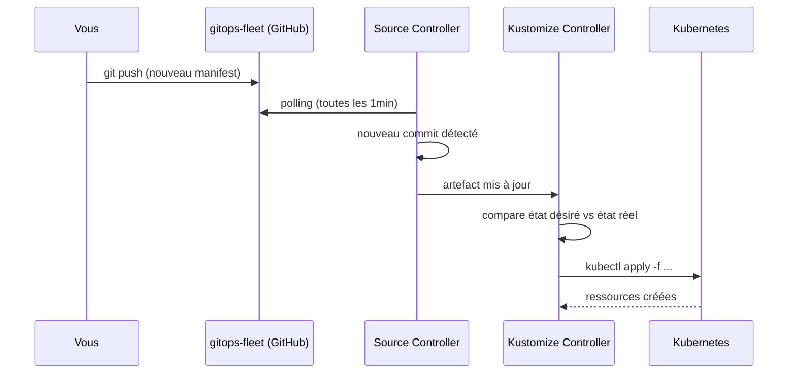

FluxCD est installé. Il est temps de déployer une première application. Ce chapitre présente les deux ressources fondamentales de FluxCD : `GitRepository` (source) et `Kustomization` (réconciliation). Vous déployez Podinfo via des manifests Kubernetes bruts pour bien comprendre le mécanisme avant d'introduire Helm.

## Podinfo, l'application fil rouge

[Podinfo](https://github.com/stefanprodan/podinfo) est une petite application web créée par Stefan Prodan — l'auteur de FluxCD. Elle est conçue spécifiquement pour démontrer des concepts Kubernetes et GitOps.

Ce qu'elle offre sans aucun développement :

- Une interface web qui affiche la version, un message et une **couleur de fond configurable**
- Des endpoints `/healthz` et `/readyz` pour les health checks
- Une configuration 100% par variables d'environnement
- Des images multi-arch disponibles sur `ghcr.io/stefanprodan/podinfo`

C'est l'application parfaite : vous verrez immédiatement l'effet de chaque changement FluxCD dans l'interface.

## Comment FluxCD déploie une application



## Créer le namespace et les manifests

Dans votre dépôt `gitops-fleet`, créez la structure suivante :

```
gitops-fleet/
├── clusters/
│   └── local/
│       ├── flux-system/          (existant)
│       └── apps.yaml             (à créer — pointe vers apps/)
└── apps/
    └── podinfo/
        ├── namespace.yaml
        ├── deployment.yaml
        └── service.yaml
```

Créez le namespace :

```yaml
# apps/podinfo/namespace.yaml
apiVersion: v1
kind: Namespace
metadata:
  name: podinfo
```

Créez le déploiement :

```yaml
# apps/podinfo/deployment.yaml
apiVersion: apps/v1
kind: Deployment
metadata:
  name: podinfo
  namespace: podinfo
spec:
  replicas: 1
  selector:
    matchLabels:
      app: podinfo
  template:
    metadata:
      labels:
        app: podinfo
    spec:
      containers:
        - name: podinfo
          image: ghcr.io/stefanprodan/podinfo:6.7.0
          ports:
            - containerPort: 9898
          env:
            - name: PODINFO_UI_COLOR
              value: "#4287f5"
            - name: PODINFO_UI_MESSAGE
              value: "Bienvenue dans mon premier déploiement GitOps !"
          readinessProbe:
            httpGet:
              path: /readyz
              port: 9898
          livenessProbe:
            httpGet:
              path: /healthz
              port: 9898
```

Créez le service :

```yaml
# apps/podinfo/service.yaml
apiVersion: v1
kind: Service
metadata:
  name: podinfo
  namespace: podinfo
spec:
  selector:
    app: podinfo
  ports:
    - port: 9898
      targetPort: 9898
```

## Créer la Kustomization FluxCD

Le fichier `clusters/local/apps.yaml` est ce qui **connecte** FluxCD à votre dossier `apps/podinfo/`. C'est une ressource `Kustomization` de FluxCD (pas de Kustomize) :

```yaml
# clusters/local/apps.yaml
apiVersion: kustomize.toolkit.fluxcd.io/v1
kind: Kustomization
metadata:
  name: apps
  namespace: flux-system
spec:
  interval: 10m
  sourceRef:
    kind: GitRepository
    name: flux-system # le GitRepository créé par le bootstrap
  path: ./apps
  prune: true
  wait: true
  timeout: 2m
```

Le `sourceRef` pointe vers le `GitRepository` `flux-system` — celui créé automatiquement par le bootstrap qui surveille votre dépôt `gitops-fleet`.

`prune: true` est crucial : si vous supprimez un manifest du dépôt, FluxCD supprime la ressource correspondante dans le cluster.

## Committer et pousser

```bash
cd gitops-fleet
git add .
git commit -m "feat(apps): deploy podinfo"
git push
```

## Observer la réconciliation

FluxCD détecte le nouveau commit dans les 60 secondes (intervalle par défaut). Vous pouvez forcer la réconciliation immédiatement :

```bash
flux reconcile kustomization flux-system --with-source
```

Suivez la progression :

```bash
flux get kustomization apps
# NAME  REVISION        SUSPENDED  READY  MESSAGE
# apps  main/b2c3d4e    False      True   Applied revision: main/b2c3d4e
```

Vérifiez que podinfo est déployé :

```bash
kubectl get all -n podinfo
```

## Accéder à l'interface Podinfo

Exposez le service localement :

```bash
kubectl port-forward svc/podinfo 9898:9898 -n podinfo
```

Ouvrez [http://localhost:9898](http://localhost:9898) dans votre navigateur. Vous voyez l'interface bleue de Podinfo avec la version `6.7.0` affichée.

## Lire les logs FluxCD

Pour comprendre ce que fait FluxCD, les logs sont votre meilleur outil :

```bash
# Logs du kustomize controller (réconciliation)
flux logs --kind=Kustomization --name=apps -n flux-system

# Logs du source controller (polling Git)
flux logs --kind=GitRepository --name=flux-system -n flux-system
```

> **Exercice** : Modifiez le message affiché par Podinfo et observez FluxCD déployer automatiquement la mise à jour.

<details>
<summary>Solution</summary>

Modifiez la variable d'environnement `PODINFO_UI_MESSAGE` dans `apps/podinfo/deployment.yaml` :

```yaml
env:
  - name: PODINFO_UI_COLOR
    value: "#4287f5"
  - name: PODINFO_UI_MESSAGE
    value: "Réconciliation automatique par FluxCD !"
```

Committez et poussez :

```bash
git add apps/podinfo/deployment.yaml
git commit -m "content(podinfo): update welcome message"
git push
```

Forcez la réconciliation (optionnel — FluxCD le fera de lui-même dans la minute) :

```bash
flux reconcile kustomization apps --with-source
```

Observez le rollout du déploiement :

```bash
kubectl rollout status deployment/podinfo -n podinfo
# deployment "podinfo" successfully rolled out
```

Rechargez [http://localhost:9898](http://localhost:9898). Le nouveau message s'affiche.

**Testez la correction de dérive** : modifiez directement le déploiement dans le cluster sans passer par Git.

```bash
kubectl set env deployment/podinfo -n podinfo PODINFO_UI_MESSAGE="Je contourne GitOps !"
```

Attendez 10 minutes (intervalle de la Kustomization) ou forcez la réconciliation :

```bash
flux reconcile kustomization apps
```

FluxCD remet automatiquement le message original. Git gagne toujours.

</details>

## Ce qu'il faut retenir

- `GitRepository` surveille un dépôt Git et expose son contenu comme artefact
- `Kustomization` (FluxCD) consomme cet artefact et applique les manifests dans le cluster
- `prune: true` garantit que le cluster reflète exactement ce qui est dans Git
- Toute modification manuelle dans le cluster est écrasée au prochain cycle de réconciliation

Le chapitre suivant remplace ces manifests bruts par une `HelmRelease`, qui offre une gestion de version, des valeurs configurables et un mécanisme d'upgrade intégré.
