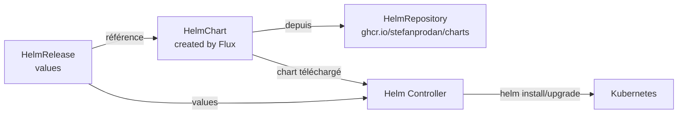

Les manifests bruts du chapitre précédent fonctionnent, mais ils ont leurs limites : pas de versionnement du chart, pas de gestion des valeurs par défaut, pas d'upgrade natif. Helm résout ces problèmes, et FluxCD intègre Helm de façon native via deux ressources : `HelmRepository` et `HelmRelease`.

## Pourquoi Helm dans un contexte GitOps ?

Un chart Helm est un package d'application — il regroupe les manifests Kubernetes avec un système de templating et des valeurs par défaut. Dans un contexte GitOps, Helm offre :

- **Versionnement sémantique** : vous épinglez une version précise (`6.7.0`) ou une contrainte (`>=6.0.0 <7.0.0`)
- **Séparation configuration / template** : seules les `values` vivent dans votre dépôt, pas les templates
- **Upgrades et rollbacks natifs** : le Helm Controller gère le cycle de vie complet

La combinaison FluxCD + Helm est le pattern le plus courant en production.

## Nettoyer les manifests précédents

Avant de créer la HelmRelease, supprimez les manifests bruts créés au chapitre précédent. Le namespace podinfo peut rester.

Supprimez `apps/podinfo/deployment.yaml` et `apps/podinfo/service.yaml` de votre dépôt `gitops-fleet`. Conservez `apps/podinfo/namespace.yaml`.

## Ajouter le HelmRepository Podinfo

Un `HelmRepository` indique à FluxCD où trouver les charts Helm. Podinfo utilise un registre OCI hébergé sur ghcr.io :

```yaml
# infrastructure/sources/podinfo.yaml
apiVersion: source.toolkit.fluxcd.io/v1
kind: HelmRepository
metadata:
  name: podinfo
  namespace: flux-system
spec:
  type: oci
  interval: 10m
  url: oci://ghcr.io/stefanprodan/charts
```

Créez le dossier `infrastructure/sources/` dans votre dépôt et ajoutez ce fichier.

## Créer la Kustomization pour l'infrastructure

Vous avez besoin d'une Kustomization FluxCD pour que FluxCD applique ce nouveau dossier. Ajoutez dans `clusters/local/` :

```yaml
# clusters/local/infrastructure.yaml
apiVersion: kustomize.toolkit.fluxcd.io/v1
kind: Kustomization
metadata:
  name: infrastructure
  namespace: flux-system
spec:
  interval: 10m
  sourceRef:
    kind: GitRepository
    name: flux-system
  path: ./infrastructure
  prune: true
```

## Créer la HelmRelease

Une `HelmRelease` décrit l'installation d'un chart Helm avec ses valeurs de configuration :

```yaml
# apps/podinfo/helmrelease.yaml
apiVersion: helm.toolkit.fluxcd.io/v2
kind: HelmRelease
metadata:
  name: podinfo
  namespace: podinfo
spec:
  interval: 10m
  chart:
    spec:
      chart: podinfo
      version: ">=6.7.0"
      sourceRef:
        kind: HelmRepository
        name: podinfo
        namespace: flux-system
  values:
    replicaCount: 1
    ui:
      color: "#4287f5"
      message: "Déployé via HelmRelease par FluxCD"
```

La section `chart.spec` décrit quel chart utiliser et depuis quelle source. La section `values` surcharge les valeurs par défaut du chart — exactement comme `helm install --set` ou un fichier `values.yaml`.

## Structure du dépôt à ce stade

```text
gitops-fleet/
├── clusters/
│   └── local/
│       ├── flux-system/
│       ├── infrastructure.yaml    (nouveau)
│       └── apps.yaml
├── infrastructure/
│   └── sources/
│       └── podinfo.yaml           (nouveau)
└── apps/
    └── podinfo/
        ├── namespace.yaml
        └── helmrelease.yaml       (remplace deployment.yaml + service.yaml)
```

## Committer et observer

```bash
git add .
git commit -m "feat(podinfo): deploy via HelmRelease"
git push
```

FluxCD réconcilie les changements. Observez l'ordre d'application :

```bash
flux get all -n flux-system
```

Vous pouvez aussi suivre l'état de la HelmRelease :

```bash
flux get helmrelease podinfo -n podinfo
# NAME     REVISION  SUSPENDED  READY  MESSAGE
# podinfo  6.7.1     False      True   Release reconciliation succeeded
```

Vérifiez dans l'historique Helm que la release est gérée :

```bash
helm list -n podinfo
# NAME     NAMESPACE  REVISION  STATUS    CHART          APP VERSION
# podinfo  podinfo    1         deployed  podinfo-6.7.1  6.7.1
```

## Mettre à jour via les values

L'intérêt de la HelmRelease est de pouvoir reconfigurer l'application en modifiant uniquement les `values` — sans toucher au chart.

Changez la couleur de l'interface dans `apps/podinfo/helmrelease.yaml` :

```yaml
values:
  replicaCount: 2
  ui:
    color: "#27ae60"
    message: "Mise à jour via les values FluxCD"
```

```bash
git add apps/podinfo/helmrelease.yaml
git commit -m "style(podinfo): change to green theme, scale to 2 replicas"
git push
```

FluxCD détecte le changement et déclenche un `helm upgrade` automatique. L'interface passe au vert.

## Les events FluxCD

Quand quelque chose se passe mal (mauvaise valeur, chart introuvable, timeout), FluxCD génère des events Kubernetes détaillés :

```bash
kubectl events -n podinfo --for=helmrelease/podinfo
```

La commande `flux events` offre une vue plus lisible :

```bash
flux events -n podinfo
```

> **Mise en pratique** : Configurez Podinfo avec une interface orange et trois replicas, puis observez le rollout.

<details>
<summary>Solution</summary>

Modifiez `apps/podinfo/helmrelease.yaml` :

```yaml
apiVersion: helm.toolkit.fluxcd.io/v2
kind: HelmRelease
metadata:
  name: podinfo
  namespace: podinfo
spec:
  interval: 10m
  chart:
    spec:
      chart: podinfo
      version: ">=6.7.0"
      sourceRef:
        kind: HelmRepository
        name: podinfo
        namespace: flux-system
  values:
    replicaCount: 3
    ui:
      color: "#e67e22"
      message: "3 replicas, thème orange"
```

Committez et poussez :

```bash
git add apps/podinfo/helmrelease.yaml
git commit -m "style(podinfo): orange theme with 3 replicas"
git push
```

Observez le déploiement :

```bash
# Surveiller le rollout en temps réel
kubectl rollout status deployment/podinfo -n podinfo

# Vérifier les 3 replicas
kubectl get pods -n podinfo
# NAME                       READY   STATUS    RESTARTS   AGE
# podinfo-7d6b8b9c8-4xkzp    1/1     Running   0          30s
# podinfo-7d6b8b9c8-8mnqv    1/1     Running   0          30s
# podinfo-7d6b8b9c8-r9pqt    1/1     Running   0          30s
```

Accédez à l'interface sur [http://localhost:9898](http://localhost:9898) (relancez le port-forward si nécessaire). L'interface est orange.

**Pour aller plus loin** : regardez les values disponibles pour le chart podinfo :

```bash
helm show values oci://ghcr.io/stefanprodan/charts/podinfo
```

Vous verrez toutes les options configurables : `logLevel`, `backend`, `cache`, `redis`, `ingress`, etc.

</details>

## Récapitulatif



`HelmRepository` + `HelmRelease` est le pattern recommandé pour tout applicatif packagé en Helm. Le chapitre suivant s'attaque au problème des secrets : comment gérer des données sensibles dans un dépôt Git sans les exposer en clair.
