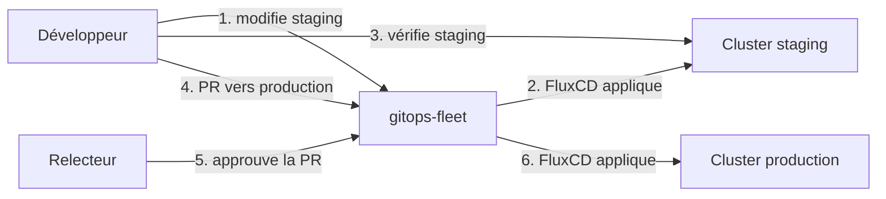

La structure staging/production est en place. La prochaine question pratique : comment faire passer une configuration de staging vers production ? Ce chapitre présente le workflow de promotion, le seul qui soit compatible avec GitOps.

## Qu'est-ce que la promotion ?

En GitOps, **promouvoir** signifie mettre à jour le dépôt Git pour qu'il décrive l'état voulu de l'environnement cible. FluxCD applique ensuite automatiquement ce changement.

Il n'y a jamais de déploiement direct vers production — tout passe par Git.



## Le workflow PR-based

La promotion manuelle via Pull Request est le pattern standard en GitOps. Il offre :

- **Un point de validation humaine** avant chaque changement en production
- **Un audit trail** : chaque promotion est un commit signé avec un auteur
- **Un mécanisme de rollback** : reverter la PR suffit pour revenir en arrière
- **Une revue de code** : un collègue peut relire la configuration avant qu'elle parte en prod

## Exemple concret : promouvoir une version de Podinfo

Imaginons que staging tourne en version `6.7.0` de Podinfo et que vous voulez passer production à `6.7.1` après validation.

### État actuel

Dans `apps/staging/podinfo/kustomization.yaml`, la version est configurée à `6.7.0` via un patch sur le chart version. Dans `apps/production/podinfo/kustomization.yaml`, la version est encore à `6.6.x`.

En pratique, la version est définie dans `apps/base/podinfo/helmrelease.yaml` :

```yaml
chart:
  spec:
    chart: podinfo
    version: "6.7.0" # version épinglée
```

### Étape 1 — Valider en staging

Mettez à jour `apps/base/podinfo/helmrelease.yaml` avec la nouvelle version :

```yaml
chart:
  spec:
    chart: podinfo
    version: "6.7.1"
```

Committez sur une branche :

```bash
git checkout -b feat/podinfo-6.7.1
git add apps/base/podinfo/helmrelease.yaml
git commit -m "chore(podinfo): bump to 6.7.1"
git push -u origin feat/podinfo-6.7.1
```

Ouvrez une PR vers `main`. FluxCD applique le changement sur staging dès que la branche... attend, ce n'est pas tout à fait ça. FluxCD surveille `main`, pas les branches de feature.

Voyons deux approches selon votre workflow.

### Approche A — Version unique (base commune)

Votre `base/` définit une seule version pour tous les environnements. Mettre à jour la base met à jour staging et production simultanément.

C'est simple mais ne permet pas d'avoir des versions différentes entre staging et production.

**Quand l'utiliser** : applications sans risque de régression, mise à jour groupée acceptable.

### Approche B — Versions indépendantes par environnement

Définissez la version séparément dans chaque overlay. La `base/` ne définit pas de version (ou définit `>=6.0.0`) :

```yaml
# apps/base/podinfo/helmrelease.yaml
chart:
  spec:
    chart: podinfo
    version: ">=6.0.0" # contrainte large — la version réelle est dans l'overlay
```

Ajoutez un patch de version dans `apps/staging/podinfo/kustomization.yaml` :

```yaml
patches:
  - patch: |
      - op: replace
        path: /spec/chart/spec/version
        value: "6.7.1"
    target:
      kind: HelmRelease
```

Et dans `apps/production/podinfo/kustomization.yaml`, la version reste à `6.7.0` jusqu'à la promotion.

**Le workflow de promotion** :

```bash
# 1. Staging tourne 6.7.1 et est validé
# 2. Créez une branche de promotion
git checkout -b promote/podinfo-6.7.1-to-production

# 3. Mettez à jour le patch de version en production
# Modifiez apps/production/podinfo/kustomization.yaml
# version: "6.7.1"

git add apps/production/podinfo/kustomization.yaml
git commit -m "chore(production): promote podinfo to 6.7.1"
git push -u origin promote/podinfo-6.7.1-to-production

# 4. Ouvrez une PR vers main
gh pr create \
  --title "chore(production): promote podinfo to 6.7.1" \
  --body "Staging validé depuis 48h. Aucune anomalie détectée."

# 5. Après review et merge, FluxCD déploie automatiquement en production
```

**Quand l'utiliser** : applications critiques, équipes avec processus de validation, SLAs stricts.

## Rollback d'une promotion

Si un problème est détecté en production après une promotion, le rollback est un simple revert Git :

```bash
git revert HEAD
git push
```

FluxCD détecte le revert et redéploie l'ancienne version. Le rollback prend le temps d'un cycle de réconciliation (moins de 10 minutes par défaut).

## Automatiser la promotion avec Flux

FluxCD peut automatiser les promotions via l'**Image Automation Controller** (couvert en Partie 5). Lorsqu'une nouvelle image passe les tests en staging, un pipeline peut mettre à jour le dépôt Git automatiquement pour déclencher la promotion en production.

> **Mise en pratique** : Simulez une promotion de staging vers production pour la couleur de l'interface Podinfo.

<details>
<summary>Solution</summary>

**Scénario** : staging utilise une nouvelle couleur violette que vous voulez promouvoir en production.

**État initial** :

- staging : couleur violette `#8e44ad`
- production : couleur verte `#27ae60`

**Étape 1** — Modifiez la couleur en staging dans `apps/staging/podinfo/kustomization.yaml` :

```yaml
patches:
  - patch: |
      - op: replace
        path: /spec/values/ui/color
        value: "#8e44ad"
      - op: replace
        path: /spec/values/ui/message
        value: "staging — nouvelle couleur violette"
```

Committez sur une branche, ouvrez une PR, mergez vers `main`. FluxCD applique le changement en staging.

Vérifiez sur [http://localhost:9898](http://localhost:9898) → fond violet.

**Étape 2** — Après validation, créez la PR de promotion :

```bash
git checkout -b promote/purple-theme-to-production
```

Modifiez `apps/production/podinfo/kustomization.yaml` pour appliquer la même couleur :

```yaml
patches:
  - patch: |
      - op: replace
        path: /spec/values/ui/color
        value: "#8e44ad"
      - op: replace
        path: /spec/values/ui/message
        value: "production — violet promu depuis staging"
```

```bash
git add apps/production/podinfo/kustomization.yaml
git commit -m "chore(production): promote purple theme from staging"
git push -u origin promote/purple-theme-to-production
gh pr create --title "chore(production): promote purple theme" --body "Validé en staging."
```

Après merge : [http://localhost:9899](http://localhost:9899) → fond violet en production.

**Étape 3** — Testez le rollback :

```bash
git revert HEAD
git push
```

Production revient au vert en moins de 10 minutes.

</details>
