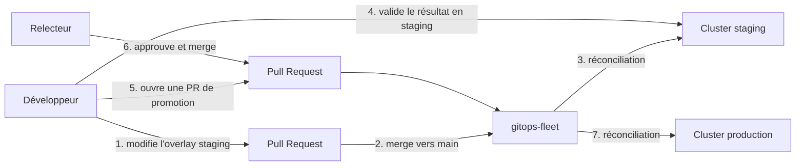

La structure staging/production est en place. Reste une question pratique : comment faire passer un changement validé en staging vers production ? Ce chapitre répond à cette question avec le seul mécanisme compatible avec GitOps — la promotion par Git.

## Qu'est-ce que la promotion ?

En GitOps, **promouvoir** ne veut rien dire de plus que : modifier le dépôt Git pour que l'overlay de l'environnement cible décrive l'état déjà validé ailleurs. FluxCD réconcilie ensuite ce changement normalement — aucune ressource Flux supplémentaire n'est nécessaire, la promotion est une opération purement Git.

Il n'y a jamais de déploiement direct vers production : ni `kubectl apply` manuel, ni `helm upgrade` local. Tout changement, y compris une promotion, passe par un commit et une Pull Request.



## Le principe : promotion par répertoire

Votre dépôt utilise déjà la structure `apps/base`, `apps/staging`, `apps/production` mise en place au chapitre précédent. Cette structure — recommandée par la documentation officielle FluxCD pour un dépôt monorepo — permet une promotion **par répertoire** : promouvoir un changement, c'est reporter dans l'overlay `apps/production` une valeur déjà appliquée et validée dans l'overlay `apps/staging`.

Le processus recommandé se déroule en deux temps :

1. **Le changement part en staging.** Il est mergé sur `main`, FluxCD le réconcilie, et l'équipe vérifie que le comportement est correct.
2. **Une fois validé, le changement est promu vers production.** Une nouvelle PR reporte la même valeur dans l'overlay production. Cette PR est elle-même soumise à revue et, idéalement, à des tests de bout en bout avant merge.

Chaque étape est donc conditionnée à une revue de Pull Request. Rien n'atteint production sans être passé par staging au préalable et sans avoir été revu une seconde fois pour la promotion elle-même.

## Exemple : tester puis promouvoir un changement d'apparence

Mettons ce principe en pratique avec un changement de thème visuel sur Podinfo.

### Étape 1 — Introduire le changement en staging

Modifiez le patch de couleur dans `apps/staging/podinfo/kustomization.yaml` :

```yaml
patches:
  - patch: |
      - op: replace
        path: /spec/values/ui/color
        value: "#8e44ad"
      - op: replace
        path: /spec/values/ui/message
        value: "staging — nouveau thème en test"
      - op: replace
        path: /metadata/namespace
        value: podinfo-staging
    target:
      kind: HelmRelease

  - patch: |
      - op: replace
        path: /metadata/name
        value: podinfo-staging
    target:
      kind: Namespace
```

Committez sur une branche, ouvrez une PR, mergez vers `main` :

```bash
git checkout -b chore/staging-purple-theme
git add apps/staging/podinfo/kustomization.yaml
git commit -m "chore(staging): try purple theme"
git push -u origin chore/staging-purple-theme
gh pr create --title "chore(staging): try purple theme" --body "Nouveau thème à valider avant promotion."
```

Après merge et réconciliation, vérifiez :

```bash
kubectl port-forward svc/podinfo 9898:9898 -n podinfo-staging
```

[http://localhost:9898](http://localhost:9898) → fond violet.

### Étape 2 — Promouvoir vers production

Le thème est validé en staging. Ouvrez une nouvelle branche depuis `main` pour la promotion :

```bash
git checkout main
git pull
git checkout -b chore/promote-purple-theme-to-production
```

Reportez exactement la même valeur dans `apps/production/podinfo/kustomization.yaml` :

```yaml
patches:
  - patch: |
      - op: replace
        path: /spec/values/replicaCount
        value: 2
      - op: replace
        path: /spec/values/ui/color
        value: "#8e44ad"
      - op: replace
        path: /spec/values/ui/message
        value: "production — nouveau thème promu depuis staging"
      - op: replace
        path: /metadata/namespace
        value: podinfo-production
    target:
      kind: HelmRelease

  - patch: |
      - op: replace
        path: /metadata/name
        value: podinfo-production
    target:
      kind: Namespace
```

Committez, poussez, ouvrez la PR de promotion :

```bash
git add apps/production/podinfo/kustomization.yaml
git commit -m "chore(production): promote purple theme from staging"
git push -u origin chore/promote-purple-theme-to-production
gh pr create \
  --title "chore(production): promote purple theme" \
  --body "Validé en staging depuis le commit précédent. Aucune anomalie détectée."
```

Après revue et merge :

```bash
kubectl port-forward svc/podinfo 9899:9898 -n podinfo-production
```

[http://localhost:9899](http://localhost:9899) → fond violet en production.

Notez ce qui a changé, et ce qui n'a pas changé : `replicaCount: 2` reste propre à production, seule la valeur validée en staging (couleur, message) a été reportée. Promouvoir ne signifie pas dupliquer tout l'overlay — seulement les valeurs concernées par le changement.

## Rollback d'une promotion

Un problème est détecté en production après cette promotion. Le rollback est un simple revert Git du commit de promotion :

```bash
git log --oneline -- apps/production/podinfo/kustomization.yaml
# a1b2c3d chore(production): promote purple theme
# ...

git revert a1b2c3d
git push
```

FluxCD détecte le revert et réconcilie l'ancien état. Le rollback prend le temps d'un cycle de réconciliation (10 minutes par défaut, ou immédiatement avec `flux reconcile kustomization apps-production --with-source`). Le rollback ne touche que production — staging n'a pas besoin d'être modifié pour ça.

### Revenir à la configuration de référence

Cet essai de thème était une démonstration. Pour repartir sur la base utilisée dans la suite de ce guide (staging en bleu, production en vert), annulez aussi le changement introduit en staging :

```bash
git log --oneline -- apps/staging/podinfo/kustomization.yaml
# d4e5f6a chore(staging): try purple theme
# ...

git revert d4e5f6a
git push
```

Après réconciliation, staging redevient bleu et production redevient verte — l'état de départ du chapitre précédent.

## Aller plus loin : automatiser la promotion

Le workflow manuel ci-dessus est la base : il fonctionne avec les ressources déjà en place, sans rien installer de plus. FluxCD propose deux mécanismes officiels pour automatiser tout ou partie de ce processus — tous deux couverts plus loin dans ce guide.

### Livraison continue en staging

L'**Image Automation Controller** (Partie 5) peut surveiller un registre Docker et mettre à jour automatiquement la version déployée en staging dès qu'une nouvelle image correspond à une politique définie (par exemple un range semver `>=6.7.0 <7.0.0`). Staging reste ainsi toujours à jour sans intervention manuelle — c'est l'usage que la documentation officielle FluxCD recommande pour cet environnement.

### Conditionner la promotion vers production

Pour éviter qu'une mise à jour automatique n'atteigne directement production, l'`ImageUpdateAutomation` peut pousser ses commits vers une branche dédiée plutôt que directement sur `main` :

```yaml
apiVersion: image.toolkit.fluxcd.io/v1beta2
kind: ImageUpdateAutomation

metadata:
  name: flux-system

spec:
  git:
    checkout:
      ref:
        branch: main
    push:
      branch: flux-image-updates
```

Une fois ce commit poussé sur `flux-image-updates`, une action GitHub Actions peut ouvrir automatiquement une Pull Request contre `main` — la promotion reste alors conditionnée à une revue humaine, mais sans avoir à écrire le patch de version à la main. Ce pattern est détaillé en Partie 5.

### Déclencher la promotion depuis un événement FluxCD

La documentation officielle FluxCD décrit aussi un workflow entièrement piloté par événements : le Notification Controller (Provider + Alert, couvert au prochain chapitre) peut envoyer un événement GitHub à chaque mise à jour réussie d'une `HelmRelease` en staging. Un workflow GitHub Actions écoute cet événement, extrait la version déployée, met à jour le manifeste `HelmRelease` de production, et ouvre la PR de promotion automatiquement — reproduisant exactement les étapes manuelles de ce chapitre, sans intervention humaine jusqu'à la revue de la PR.

> **Mise en pratique** : Un pic de charge est anticipé sur Podinfo. Testez temporairement 3 replicas en staging, validez, promouvez ce changement vers production, puis revenez à la configuration de référence.

<details>
<summary>Solution</summary>

**Étape 1** — Ajoutez un patch de replicas dans `apps/staging/podinfo/kustomization.yaml`, en plus des patches existants :

```yaml
patches:
  - patch: |
      - op: replace
        path: /spec/values/replicaCount
        value: 3
      - op: replace
        path: /spec/values/ui/color
        value: "#4287f5"
      - op: replace
        path: /spec/values/ui/message
        value: "staging — test de charge"
      - op: replace
        path: /metadata/namespace
        value: podinfo-staging
    target:
      kind: HelmRelease

  - patch: |
      - op: replace
        path: /metadata/name
        value: podinfo-staging
    target:
      kind: Namespace
```

```bash
git checkout -b chore/staging-load-test-replicas
git add apps/staging/podinfo/kustomization.yaml
git commit -m "chore(staging): test 3 replicas ahead of expected load spike"
git push -u origin chore/staging-load-test-replicas
gh pr create --title "chore(staging): test 3 replicas" --body "Validation avant promotion en production."
```

Après merge, vérifiez :

```bash
kubectl get pods -n podinfo-staging
# 3 pods podinfo Running
```

**Étape 2** — Le comportement est stable avec 3 replicas. Promouvez vers production :

```bash
git checkout main
git pull
git checkout -b chore/promote-replicas-to-production
```

Modifiez `apps/production/podinfo/kustomization.yaml` :

```yaml
patches:
  - patch: |
      - op: replace
        path: /spec/values/replicaCount
        value: 3
      - op: replace
        path: /spec/values/ui/color
        value: "#27ae60"
      - op: replace
        path: /spec/values/ui/message
        value: "production — stable"
      - op: replace
        path: /metadata/namespace
        value: podinfo-production
    target:
      kind: HelmRelease

  - patch: |
      - op: replace
        path: /metadata/name
        value: podinfo-production
    target:
      kind: Namespace
```

```bash
git add apps/production/podinfo/kustomization.yaml
git commit -m "chore(production): promote replica count bump from staging"
git push -u origin chore/promote-replicas-to-production
gh pr create \
  --title "chore(production): scale podinfo to 3 replicas" \
  --body "Testé en staging sous charge simulée. Aucune anomalie détectée."
```

Après merge, vérifiez :

```bash
kubectl get pods -n podinfo-production
# 3 pods podinfo Running
```

**Étape 3** — Le pic de charge est passé. Revenez à la configuration de référence des deux côtés :

```bash
git log --oneline -- apps/production/podinfo/kustomization.yaml
# revert du commit "chore(production): promote replica count bump from staging"
git revert <sha-production>

git log --oneline -- apps/staging/podinfo/kustomization.yaml
# revert du commit "chore(staging): test 3 replicas ahead of expected load spike"
git revert <sha-staging>

git push
```

Après réconciliation, staging revient à 1 replica (valeur par défaut héritée de la base) et production revient à 2 replicas.

**Pourquoi deux reverts séparés** : le revert de production annule l'incident potentiel immédiatement, sans dépendre de l'état de staging. Le revert de staging est un nettoyage indépendant — les deux environnements peuvent être ramenés à leur état de référence à des moments différents, chacun avec sa propre PR.

</details>
