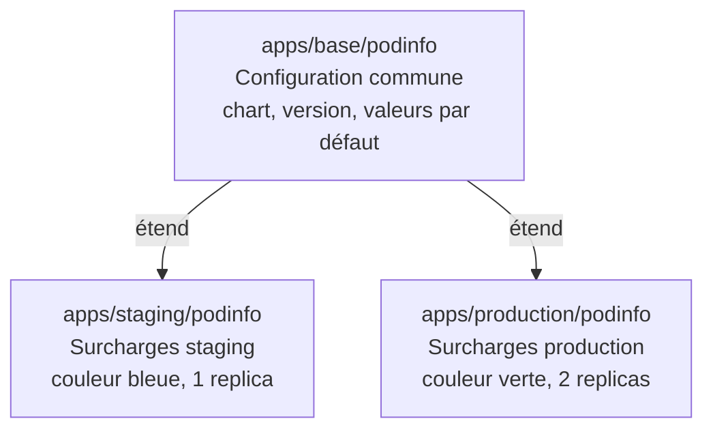

Jusqu'ici, votre dépôt `gitops-fleet` déploie une seule application dans un seul environnement. En production, vous avez besoin d'au moins deux environnements (staging et production) avec des configurations différentes. Ce chapitre restructure le dépôt pour accueillir ce cas réel.

## Les patterns de structuration

Il existe deux approches principales pour organiser un dépôt GitOps multi-environnements.

### Poly-repo

Un dépôt par environnement :

```text
gitops-staging/    → pointe vers le cluster staging
gitops-production/ → pointe vers le cluster production
```

**Avantages** : isolation totale, permissions Git par environnement.
**Inconvénients** : duplication, synchronisation entre dépôts, overhead de maintenance.

### Monorepo (recommandé)

Un seul dépôt, une arborescence par environnement :

```text
gitops-fleet/
├── clusters/
│   └── local/          # un sous-dossier par cluster
└── apps/
    ├── base/           # configuration commune
    ├── staging/        # surcharges staging
    └── production/     # surcharges production
```

**Avantages** : vue d'ensemble, changements atomiques, historique unifié.
**Inconvénients** : permissions moins granulaires (mitigeable avec CODEOWNERS).

Ce guide utilise le pattern monorepo — c'est ce que recommande la documentation officielle FluxCD.

## La structure cible

Voici la structure complète vers laquelle vous allez migrer :

```text
gitops-fleet/
├── clusters/
│   └── local/
│       ├── flux-system/         (existant)
│       ├── infrastructure.yaml  (existant)
│       └── apps.yaml            (à modifier)
├── infrastructure/
│   └── sources/
│       └── podinfo.yaml         (existant)
└── apps/
    ├── base/
    │   └── podinfo/
    │       ├── kustomization.yaml
    │       ├── namespace.yaml
    │       └── helmrelease.yaml  (config commune)
    ├── staging/
    │   └── podinfo/
    │       ├── kustomization.yaml
    │       └── values.yaml       (surcharges staging)
    └── production/
        └── podinfo/
            ├── kustomization.yaml
            └── values.yaml       (surcharges production)
```

## La logique base / overlay



`base/` contient ce qui est commun aux deux environnements. `staging/` et `production/` ne contiennent que les **différences** par rapport à la base.

## Migrer vers la nouvelle structure

### Étape 1 — Créer la base

Créez `apps/base/podinfo/namespace.yaml` :

```yaml
apiVersion: v1
kind: Namespace
metadata:
  name: podinfo-staging
```

Créez `apps/base/podinfo/helmrelease.yaml` (configuration commune) :

```yaml
apiVersion: helm.toolkit.fluxcd.io/v2
kind: HelmRelease
metadata:
  name: podinfo
  namespace: podinfo-staging
spec:
  interval: 10m
  chart:
    spec:
      chart: podinfo
      version: ">=6.7.0"
      sourceRef:
        kind: HelmRepository
        name: podinfo
        namespace: flux-system
  values:
    replicaCount: 1
    ui:
      color: "#4287f5"
      message: "environnement non configuré"
```

Créez `apps/base/podinfo/kustomization.yaml` (point d'entrée Kustomize) :

```yaml
apiVersion: kustomize.config.k8s.io/v1beta1
kind: Kustomization
resources:
  - namespace.yaml
  - helmrelease.yaml
```

### Étape 2 — Créer l'overlay staging

Créez `apps/staging/podinfo/values.yaml` (valeurs de surcharge) :

```yaml
replicaCount: 1
ui:
  color: "#4287f5"
  message: "staging — en cours de test"
```

Créez `apps/staging/podinfo/kustomization.yaml` :

```yaml
apiVersion: kustomize.config.k8s.io/v1beta1
kind: Kustomization
resources:
  - ../../base/podinfo
patches:
  - patch: |
      - op: replace
        path: /spec/values/ui/color
        value: "#4287f5"
      - op: replace
        path: /spec/values/ui/message
        value: "staging — en cours de test"
      - op: replace
        path: /metadata/namespace
        value: podinfo-staging
    target:
      kind: HelmRelease
  - patch: |
      - op: replace
        path: /metadata/name
        value: podinfo-staging
    target:
      kind: Namespace
```

### Étape 3 — Créer l'overlay production

Créez `apps/production/podinfo/kustomization.yaml` :

```yaml
apiVersion: kustomize.config.k8s.io/v1beta1
kind: Kustomization
resources:
  - ../../base/podinfo
patches:
  - patch: |
      - op: replace
        path: /spec/values/replicaCount
        value: 2
      - op: replace
        path: /spec/values/ui/color
        value: "#27ae60"
      - op: replace
        path: /spec/values/ui/message
        value: "production — stable"
      - op: replace
        path: /metadata/namespace
        value: podinfo-production
    target:
      kind: HelmRelease
  - patch: |
      - op: replace
        path: /metadata/name
        value: podinfo-production
    target:
      kind: Namespace
```

### Étape 4 — Mettre à jour la Kustomization FluxCD

Modifiez `clusters/local/apps.yaml` pour pointer vers les deux environnements séparément :

```yaml
apiVersion: kustomize.toolkit.fluxcd.io/v1
kind: Kustomization
metadata:
  name: apps-staging
  namespace: flux-system
spec:
  interval: 10m
  sourceRef:
    kind: GitRepository
    name: flux-system
  path: ./apps/staging
  prune: true
  wait: true
---
apiVersion: kustomize.toolkit.fluxcd.io/v1
kind: Kustomization
metadata:
  name: apps-production
  namespace: flux-system
spec:
  interval: 10m
  sourceRef:
    kind: GitRepository
    name: flux-system
  path: ./apps/production
  prune: true
  wait: true
```

## Committer et vérifier

```bash
git add .
git commit -m "refactor(apps): migrate to base/staging/production structure"
git push
```

Après réconciliation, vous avez deux namespaces :

```bash
kubectl get namespaces | grep podinfo
# podinfo-staging     Active
# podinfo-production  Active

kubectl get pods -n podinfo-staging
# podinfo-xxx   1/1   Running   (bleu)

kubectl get pods -n podinfo-production
# podinfo-xxx   1/1   Running   (vert)
# podinfo-xxx   1/1   Running   (vert — 2 replicas)
```

Port-forward staging :

```bash
kubectl port-forward svc/podinfo 9898:9898 -n podinfo-staging
```

Port-forward production (sur un autre port) :

```bash
kubectl port-forward svc/podinfo 9899:9898 -n podinfo-production
```

[http://localhost:9898](http://localhost:9898) → staging, fond bleu.
[http://localhost:9899](http://localhost:9899) → production, fond vert.

> **Mise en pratique** : Ajoutez un troisième environnement `development` avec Podinfo en rouge et un seul replica.

<details>
<summary>Solution</summary>

Créez `apps/development/podinfo/kustomization.yaml` :

```yaml
apiVersion: kustomize.config.k8s.io/v1beta1
kind: Kustomization
resources:
  - ../../base/podinfo
patches:
  - patch: |
      - op: replace
        path: /spec/values/replicaCount
        value: 1
      - op: replace
        path: /spec/values/ui/color
        value: "#e74c3c"
      - op: replace
        path: /spec/values/ui/message
        value: "development — expérimental"
      - op: replace
        path: /metadata/namespace
        value: podinfo-development
    target:
      kind: HelmRelease
  - patch: |
      - op: replace
        path: /metadata/name
        value: podinfo-development
    target:
      kind: Namespace
```

Ajoutez une Kustomization FluxCD dans `clusters/local/apps.yaml` :

```yaml
---
apiVersion: kustomize.toolkit.fluxcd.io/v1
kind: Kustomization
metadata:
  name: apps-development
  namespace: flux-system
spec:
  interval: 10m
  sourceRef:
    kind: GitRepository
    name: flux-system
  path: ./apps/development
  prune: true
  wait: true
```

```bash
git add apps/development/ clusters/local/apps.yaml
git commit -m "feat(apps): add development environment"
git push
```

Accédez sur [http://localhost:9900](http://localhost:9900) après `port-forward svc/podinfo 9900:9898 -n podinfo-development`.

</details>
