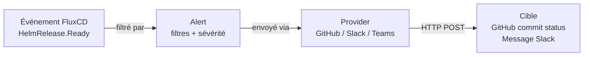

FluxCD peut notifier des équipes ou des systèmes externes quand des événements se produisent : déploiement réussi, échec de réconciliation, nouvelle version détectée. Ce chapitre configure les notifications via le Notification Controller.

## Les trois ressources du Notification Controller



**Provider** : définit la destination et le protocole (Slack, GitHub, Teams, PagerDuty…).

**Alert** : définit quels événements déclencher et vers quel Provider les envoyer.

**Receiver** : webhooks entrants (GitHub → FluxCD). Couvert en fin de chapitre.

## Configurer un Provider GitHub

Le Provider GitHub crée des **commit statuses** sur votre dépôt `gitops-fleet` — les petites icônes ✅ ou ❌ que vous voyez sur les commits dans l'interface GitHub.

Créez d'abord un token GitHub avec la permission `repo:status`. Stockez-le dans un Secret :

```bash
kubectl create secret generic github-token \
  --namespace=flux-system \
  --from-literal=token=$GITHUB_TOKEN
```

Chiffrez-le avec SOPS si vous le committez dans le dépôt :

```yaml
# infrastructure/notifications/secret-github.yaml
apiVersion: v1
kind: Secret
metadata:
  name: github-token
  namespace: flux-system
stringData:
  token: "ghp_votretoken"
```

```bash
sops --encrypt --in-place infrastructure/notifications/secret-github.yaml
```

Créez le Provider :

```yaml
# infrastructure/notifications/provider-github.yaml
apiVersion: notification.toolkit.fluxcd.io/v1beta3
kind: Provider
metadata:
  name: github
  namespace: flux-system
spec:
  type: github
  address: https://github.com/$GITHUB_USER/gitops-fleet
  secretRef:
    name: github-token
```

## Configurer une Alert

Une `Alert` écoute des événements FluxCD et les envoie au Provider. Configurez-la pour notifier sur tous les changements de `HelmRelease` :

```yaml
# infrastructure/notifications/alert-staging.yaml
apiVersion: notification.toolkit.fluxcd.io/v1beta3
kind: Alert
metadata:
  name: staging-helmreleases
  namespace: flux-system
spec:
  providerRef:
    name: github
  eventSeverity: info
  eventSources:
    - kind: HelmRelease
      namespace: podinfo-staging
      name: "*"
  summary: "Staging — déploiement HelmRelease"
```

`eventSeverity: info` capture tous les événements, y compris les succès. Utilisez `error` pour n'alerter qu'en cas d'échec.

`name: "*"` écoute toutes les HelmRelease du namespace podinfo-staging.

## Ajouter la Kustomization pour les notifications

Créez `clusters/local/notifications.yaml` :

```yaml
apiVersion: kustomize.toolkit.fluxcd.io/v1
kind: Kustomization
metadata:
  name: notifications
  namespace: flux-system
spec:
  interval: 10m
  sourceRef:
    kind: GitRepository
    name: flux-system
  path: ./infrastructure/notifications
  prune: true
```

## Committer et vérifier

```bash
git add infrastructure/notifications/ clusters/local/notifications.yaml
git commit -m "feat(notifications): add github provider and staging alert"
git push
```

Vérifiez le statut du Provider :

```bash
flux get alert-providers -n flux-system
# NAME    READY  MESSAGE
# github  True   Initialized
```

Vérifiez l'Alert :

```bash
flux get alerts -n flux-system
# NAME                   READY  MESSAGE
# staging-helmreleases   True   Initialized
```

Déclenchez un déploiement (modifiez un message Podinfo) et regardez les statuts apparaître sur les commits dans GitHub.

## Provider Slack

Pour notifier un channel Slack, utilisez un webhook entrant :

```yaml
# infrastructure/notifications/provider-slack.yaml
apiVersion: notification.toolkit.fluxcd.io/v1beta3
kind: Provider
metadata:
  name: slack
  namespace: flux-system
spec:
  type: slack
  channel: "#deployments"
  secretRef:
    name: slack-webhook
```

Le Secret `slack-webhook` contient la clé `address` avec l'URL du webhook Slack :

```yaml
apiVersion: v1
kind: Secret
metadata:
  name: slack-webhook
  namespace: flux-system
stringData:
  address: "https://hooks.slack.com/services/xxx/yyy/zzz"
```

Chiffrez-le avec SOPS avant de le committer.

## Webhooks entrants — Receiver

Par défaut, FluxCD poll Git toutes les 1 à 10 minutes. Si vous voulez une réconciliation instantanée à chaque push, configurez un `Receiver` — un webhook que GitHub appellera à chaque push.

```yaml
# infrastructure/notifications/receiver-github.yaml
apiVersion: notification.toolkit.fluxcd.io/v1
kind: Receiver
metadata:
  name: github-receiver
  namespace: flux-system
spec:
  type: github
  events:
    - "ping"
    - "push"
  secretRef:
    name: receiver-token
  resources:
    - kind: GitRepository
      name: flux-system
      namespace: flux-system
```

Créez le Secret pour valider les webhooks GitHub :

```bash
TOKEN=$(head -c 12 /dev/urandom | shasum | cut -d ' ' -f1)
kubectl create secret generic receiver-token \
  --namespace=flux-system \
  --from-literal=token=$TOKEN
```

Récupérez l'URL du webhook exposée par FluxCD :

```bash
kubectl get receiver github-receiver -n flux-system \
  -o jsonpath='{.status.webhookPath}'
# /hook/sha256~abc123...
```

Configurez ce webhook dans les settings GitHub de votre dépôt `gitops-fleet` avec l'URL complète : `https://votre-cluster/hook/sha256~abc123...`.

> **Exercice** : Configurez une alerte qui notifie uniquement en cas d'erreur sur les HelmRelease de production.

<details>
<summary>Solution</summary>

Créez `infrastructure/notifications/alert-production-errors.yaml` :

```yaml
apiVersion: notification.toolkit.fluxcd.io/v1beta3
kind: Alert
metadata:
  name: production-errors
  namespace: flux-system
spec:
  providerRef:
    name: github # ou slack si configuré
  eventSeverity: error
  eventSources:
    - kind: HelmRelease
      namespace: podinfo-production
      name: "*"
    - kind: Kustomization
      namespace: flux-system
      name: apps-production
  summary: "🚨 Production — erreur de déploiement"
```

`eventSeverity: error` filtre uniquement les événements d'erreur — pas les succès, pas les info.

Les sources incluent à la fois les `HelmRelease` (problèmes de chart, values invalides) et la `Kustomization` `apps-production` (problèmes de réconciliation Git).

```bash
git add infrastructure/notifications/alert-production-errors.yaml
git commit -m "feat(notifications): add production error alerts"
git push
```

Pour tester l'alerte, introduisez volontairement une erreur dans la HelmRelease production (par exemple une version de chart inexistante `version: "99.99.99"`) et observez l'alerte se déclencher.

```bash
flux events -n flux-system
# HelmRelease/podinfo chart fetch failed: chart not found: podinfo-99.99.99
```

Revenez à une version valide pour corriger.

</details>
