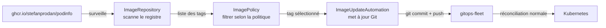

Jusqu'ici, les mises à jour de version sont manuelles : vous modifiez le dépôt Git, FluxCD déploie. L'Image Automation Controller inverse ce flux : il surveille un registre Docker, détecte de nouvelles versions selon une politique, et met à jour le dépôt Git automatiquement. C'est le GitOps complet — même les mises à jour d'images passent par Git.

## Les trois ressources de l'Image Automation



**ImageRepository** : scanne un registre Docker à intervalle régulier et garde la liste des tags disponibles.

**ImagePolicy** : filtre les tags selon une politique (semver, dernier tag alphanumérique, regex) et sélectionne le tag "courant".

**ImageUpdateAutomation** : quand la policy change de valeur (nouvelle version détectée), met à jour automatiquement les manifests dans le dépôt Git et pousse le commit.

## Installer le controller Image Automation

L'Image Automation Controller n'est pas installé par défaut avec `flux bootstrap`. Activez-le explicitement :

```bash
flux bootstrap github \
  --owner=$GITHUB_USER \
  --repository=gitops-fleet \
  --branch=main \
  --path=clusters/local \
  --personal \
  --components-extra=image-reflector-controller,image-automation-controller
```

Si FluxCD est déjà installé, patchez le déploiement existant ou réexécutez le bootstrap avec les composants supplémentaires (idempotent).

Vérifiez :

```bash
flux check
# ✔ image-automation-controller: deployment ready
# ✔ image-reflector-controller: deployment ready
```

## Créer un ImageRepository

L'ImageRepository scanne `ghcr.io/stefanprodan/podinfo` pour lister tous les tags disponibles :

```yaml
# infrastructure/image-automation/imagerepository-podinfo.yaml
apiVersion: image.toolkit.fluxcd.io/v1beta2
kind: ImageRepository
metadata:
  name: podinfo
  namespace: flux-system
spec:
  image: ghcr.io/stefanprodan/podinfo
  interval: 5m
```

Vérifiez que le scan fonctionne :

```bash
flux get image repository podinfo -n flux-system
# NAME     LAST SCAN            TAGS  READY
# podinfo  2026-04-24T10:00:00  200+  True
```

## Créer une ImagePolicy

L'ImagePolicy sélectionne le tag à utiliser. Pour Podinfo, on veut la dernière version stable en semver `6.x` :

```yaml
# infrastructure/image-automation/imagepolicy-podinfo.yaml
apiVersion: image.toolkit.fluxcd.io/v1beta2
kind: ImagePolicy
metadata:
  name: podinfo
  namespace: flux-system
spec:
  imageRepositoryRef:
    name: podinfo
  policy:
    semver:
      range: ">=6.7.0 <7.0.0"
```

La politique `semver` avec `range` sélectionne le tag le plus récent dans la plage. Autres politiques disponibles :

| Politique                      | Description                               |
| ------------------------------ | ----------------------------------------- |
| `semver: { range: ">=1.0.0" }` | Plus récente version semver dans la plage |
| `alphabetical: { order: asc }` | Dernier tag alphabétiquement              |
| `numerical: { order: asc }`    | Dernier tag numérique                     |

Vérifiez le tag sélectionné :

```bash
flux get image policy podinfo -n flux-system
# NAME     LATEST IMAGE                               READY
# podinfo  ghcr.io/stefanprodan/podinfo:6.7.1        True
```

## Annoter les manifests avec des marqueurs

Pour que l'ImageUpdateAutomation sache **où** mettre à jour la version dans les manifests, ajoutez des marqueurs (commentaires spéciaux) dans votre HelmRelease :

```yaml
# apps/base/podinfo/helmrelease.yaml
spec:
  chart:
    spec:
      chart: podinfo
      version: "6.7.0" # {"$imagepolicy": "flux-system:podinfo:tag"}
```

Le commentaire `{"$imagepolicy": "flux-system:podinfo:tag"}` indique à l'ImageUpdateAutomation de mettre à jour ce champ quand la policy `podinfo` change de valeur. `:tag` extrait uniquement le tag (sans le registry et le nom d'image).

## Créer l'ImageUpdateAutomation

```yaml
# infrastructure/image-automation/imageupdateautomation.yaml
apiVersion: image.toolkit.fluxcd.io/v1beta2
kind: ImageUpdateAutomation
metadata:
  name: flux-system
  namespace: flux-system
spec:
  interval: 5m
  sourceRef:
    kind: GitRepository
    name: flux-system
  git:
    checkout:
      ref:
        branch: main
    commit:
      author:
        email: fluxcdbot@users.noreply.github.com
        name: FluxCD Bot
      messageTemplate: |
        chore(image): update {{range .Updated.Images}}{{println .}}{{end}}
    push:
      branch: main
  update:
    path: ./apps
    strategy: Setters
```

L'`ImageUpdateAutomation` :

1. Checkout `main` de votre dépôt
2. Recherche les marqueurs `$imagepolicy` dans `./apps`
3. Met à jour les valeurs correspondantes
4. Committe avec le message template et pousse vers `main`

## Committer et observer

```bash
git add infrastructure/image-automation/ infrastructure/sources/
git commit -m "feat(image-automation): track podinfo versions automatically"
git push
```

Ajoutez la Kustomization FluxCD pour ce nouveau dossier dans `clusters/local/infrastructure.yaml`.

Après quelques minutes, vérifiez :

```bash
flux get image all -n flux-system
```

Quand l'Image Automation détecte une nouvelle version de Podinfo (par exemple `6.7.2`), elle modifie automatiquement votre dépôt Git :

```bash
git log --oneline
# a1b2c3d chore(image): update ghcr.io/stefanprodan/podinfo:6.7.2
# ...
```

Et FluxCD déploie la nouvelle version sans aucune intervention humaine.

> **Exercice** : Configurez une politique qui suit uniquement les versions de Podinfo en `6.6.x` (branche mineure fixée).

<details>
<summary>Solution</summary>

Modifiez `infrastructure/image-automation/imagepolicy-podinfo.yaml` :

```yaml
apiVersion: image.toolkit.fluxcd.io/v1beta2
kind: ImagePolicy
metadata:
  name: podinfo
  namespace: flux-system
spec:
  imageRepositoryRef:
    name: podinfo
  policy:
    semver:
      range: ">=6.6.0 <6.7.0"
```

La plage `>=6.6.0 <6.7.0` sélectionne uniquement les versions `6.6.x`. Si Podinfo publie `6.6.5`, l'automation met à jour le dépôt. La version `6.7.0` est ignorée.

```bash
git add infrastructure/image-automation/imagepolicy-podinfo.yaml
git commit -m "chore(image-policy): pin podinfo to 6.6.x minor branch"
git push
```

Vérifiez le tag sélectionné :

```bash
flux get image policy podinfo -n flux-system
# LATEST IMAGE: ghcr.io/stefanprodan/podinfo:6.6.x (dernière dans la plage)
```

**Pour tester sans attendre une vraie nouvelle release** : utilisez la politique `alphabetical` qui sélectionne immédiatement un tag existant :

```yaml
policy:
  alphabetical:
    order: asc
```

Cela sélectionne le dernier tag alphabétiquement (souvent `latest` ou la version la plus récente selon le naming). Vous verrez l'automation agir immédiatement.

Revenez ensuite à la politique semver :

```yaml
policy:
  semver:
    range: ">=6.7.0 <7.0.0"
```

</details>
