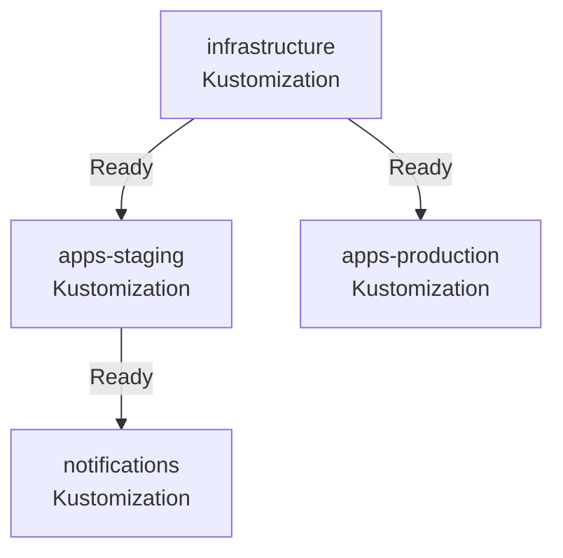

Ce dernier chapitre couvre les patterns qui font la différence entre une installation GitOps qui fonctionne et une plateforme de production robuste : dépendances explicites entre composants, substitutions avancées, multi-tenancy, et détection de dérive.

## Dépendances avec `dependsOn`

Dans un cluster avec plusieurs Kustomizations, l'ordre de déploiement est important. Une application ne doit pas se déployer avant que sa base de données soit prête. `dependsOn` rend ces dépendances explicites.

```yaml
# clusters/local/apps.yaml
apiVersion: kustomize.toolkit.fluxcd.io/v1
kind: Kustomization
metadata:
  name: apps-staging
  namespace: flux-system
spec:
  dependsOn:
    - name: infrastructure # attend que infrastructure soit Ready
  interval: 10m
  sourceRef:
    kind: GitRepository
    name: flux-system
  path: ./apps/staging
  prune: true
```



**Points clés** :

- `dependsOn` est évalué à chaque cycle de réconciliation
- Si la dépendance est en erreur, la Kustomization dépendante ne réconcilie pas
- Les dépendances circulaires sont interdites (FluxCD les détecte et lève une erreur)
- `dependsOn` fonctionne aussi dans les `HelmRelease`

## Substitutions avancées depuis un ConfigMap

Pour les clusters avec de nombreuses variables partagées, centralisez-les dans un ConfigMap plutôt que de les répéter dans chaque Kustomization :

```yaml
# infrastructure/configs/cluster-vars.yaml
apiVersion: v1
kind: ConfigMap
metadata:
  name: cluster-vars
  namespace: flux-system
data:
  CLUSTER_NAME: "local"
  DOMAIN: "learning.peyet.ddns.net"
  REGISTRY: "ghcr.io/monorg"
  DEFAULT_REPLICAS: "1"
```

Référencez-le dans les Kustomizations :

```yaml
postBuild:
  substituteFrom:
    - kind: ConfigMap
      name: cluster-vars
      optional: false
  substitute:
    ENV_NAME: staging # variables locales (écrasent le ConfigMap)
    PODINFO_COLOR: "#4287f5"
```

Les variables du `substitute` inline écrasent celles du ConfigMap — utile pour des surcharges ponctuelles par environnement.

## Drift detection et réconciliation forcée

FluxCD réconcilie à intervalle régulier (`interval`), mais aussi dès qu'il détecte une **dérive** entre l'état désiré (Git) et l'état réel (cluster). Cette détection fonctionne via le mécanisme de hash comparison des ressources.

Pour vérifier l'état de dérive d'une ressource :

```bash
flux get kustomization apps-staging -n flux-system -o json | \
  jq '.status.conditions[] | select(.type=="Ready")'
```

Pour forcer une réconciliation immédiate sans attendre l'intervalle :

```bash
# Réconcilier et re-télécharger la source Git
flux reconcile kustomization apps-staging --with-source

# Réconcilier une HelmRelease spécifique
flux reconcile helmrelease podinfo -n podinfo-staging
```

Pour surveiller une ressource en continu jusqu'à ce qu'elle soit Ready :

```bash
flux get kustomization apps-staging --watch
```

## Multi-tenancy

Dans un cluster partagé entre plusieurs équipes, vous pouvez restreindre ce que chaque Kustomization FluxCD peut déployer. Par défaut, le Kustomize Controller opère avec les permissions du ServiceAccount `flux-system` — qui a des droits cluster-admin.

Pour restreindre une Kustomization à un namespace spécifique :

```yaml
apiVersion: kustomize.toolkit.fluxcd.io/v1
kind: Kustomization
metadata:
  name: team-a-apps
  namespace: flux-system
spec:
  serviceAccountName: team-a-reconciler # ServiceAccount avec permissions limitées
  targetNamespace: team-a # force toutes les ressources dans ce namespace
  interval: 10m
  sourceRef:
    kind: GitRepository
    name: flux-system
  path: ./tenants/team-a
  prune: true
```

Créez le ServiceAccount avec des droits limités :

```yaml
apiVersion: v1
kind: ServiceAccount
metadata:
  name: team-a-reconciler
  namespace: flux-system
---
apiVersion: rbac.authorization.k8s.io/v1
kind: RoleBinding
metadata:
  name: team-a-reconciler
  namespace: team-a
subjects:
  - kind: ServiceAccount
    name: team-a-reconciler
    namespace: flux-system
roleRef:
  kind: ClusterRole
  name: cluster-admin
  apiGroup: rbac.authorization.k8s.io
```

Avec `targetNamespace`, toute ressource sans namespace explicite est déployée dans `team-a`. Les ressources qui essaient de cibler d'autres namespaces sont rejetées.

## Réconciliation conditionnelle avec `suspend`

Suspendre temporairement une Kustomization ou une HelmRelease est utile pour les maintenances planifiées ou les investigations d'incident :

```yaml
# Via kubectl patch
kubectl patch kustomization apps-staging -n flux-system \
  --type=merge \
  -p '{"spec":{"suspend":true}}'

# Via flux CLI (préféré)
flux suspend kustomization apps-staging
flux resume kustomization apps-staging
```

**Automater la suspension** : dans des environnements de dev, suspendez automatiquement la réconciliation la nuit pour économiser des ressources, et reprenez le matin.

## OCI Artifacts

FluxCD v2 supporte les **OCI artifacts** — des images OCI qui contiennent des manifests Kubernetes au lieu de code applicatif. C'est une alternative à Git pour distribuer des configurations :

```yaml
apiVersion: source.toolkit.fluxcd.io/v1beta2
kind: OCIRepository
metadata:
  name: podinfo-manifests
  namespace: flux-system
spec:
  interval: 5m
  url: oci://ghcr.io/monorg/podinfo-manifests
  ref:
    semver: ">=1.0.0"
```

Publier des manifests via OCI permet :

- **Versionnement immutable** : une version OCI ne peut pas être modifiée après publication
- **Distribution** : les configurations peuvent être partagées entre organisations via des registres OCI publics ou privés
- **Air-gapped** : dans des environnements sans accès Git, les artefacts OCI peuvent être mirrorés localement

## `wait` vs `healthChecks` : choisir le bon outil

| Cas                                                   | Solution              |
| ----------------------------------------------------- | --------------------- |
| Attendre que toutes les ressources soient Ready       | `wait: true`          |
| Définir explicitement quelles ressources surveiller   | `healthChecks: [...]` |
| Timeout si les ressources ne démarrent pas            | `timeout: 5m`         |
| Ignorer l'état de santé (déploiement fire-and-forget) | Ni l'un ni l'autre    |

`wait: true` est le choix par défaut raisonnable. `healthChecks` explicites sont utiles pour les ressources custom (CRDs tierces) que FluxCD ne sait pas évaluer automatiquement.

## Récapitulatif du dépôt gitops-fleet final

À l'issue de ce guide, votre dépôt `gitops-fleet` ressemble à ceci :

```
gitops-fleet/
├── .sops.yaml
├── clusters/
│   └── local/
│       ├── flux-system/
│       ├── infrastructure.yaml
│       ├── apps.yaml
│       └── notifications.yaml
├── infrastructure/
│   ├── sources/
│   │   ├── podinfo.yaml
│   │   ├── prometheus-community.yaml
│   │   ├── flagger.yaml
│   │   └── ingress-nginx.yaml
│   ├── configs/
│   │   └── cluster-vars.yaml
│   ├── monitoring/
│   │   ├── namespace.yaml
│   │   ├── helmrelease.yaml
│   │   └── flux-monitors.yaml
│   ├── flagger/
│   │   ├── namespace.yaml
│   │   ├── helmrelease.yaml
│   │   └── loadtester.yaml
│   ├── ingress-nginx/
│   │   ├── namespace.yaml
│   │   └── helmrelease.yaml
│   ├── image-automation/
│   │   ├── imagerepository-podinfo.yaml
│   │   ├── imagepolicy-podinfo.yaml
│   │   └── imageupdateautomation.yaml
│   └── notifications/
│       ├── provider-github.yaml
│       ├── alert-staging.yaml
│       └── alert-production-errors.yaml
└── apps/
    ├── base/
    │   └── podinfo/
    │       ├── kustomization.yaml
    │       ├── namespace.yaml
    │       ├── helmrelease.yaml
    │       └── canary.yaml
    ├── staging/
    │   └── podinfo/
    │       └── kustomization.yaml
    └── production/
        └── podinfo/
            └── kustomization.yaml
```

Ce dépôt est un exemple complet de ce que l'on appelle un **fleet repository** — un dépôt qui décrit l'état complet d'un cluster (ou d'une flotte de clusters) de façon déclarative, versionné dans Git, déployé et réconcilié automatiquement par FluxCD.

## Aller plus loin

Les sujets que ce guide n'a pas couverts mais qui valent la peine d'être explorés :

- **Multi-cluster** : un dépôt `gitops-fleet` qui gère plusieurs clusters simultanément avec des configurations différentes par cluster
- **Bootstrap sécurisé** : utiliser GitHub Actions OIDC au lieu d'un token statique pour le bootstrap
- **Flux avec Terraform** : appliquer des changements d'infrastructure Terraform en même temps que les manifests Kubernetes
- **Weave GitOps** : interface web open-source pour visualiser et gérer FluxCD depuis un navigateur
- **VSCode extension FluxCD** : visualiser l'état de FluxCD depuis votre IDE
