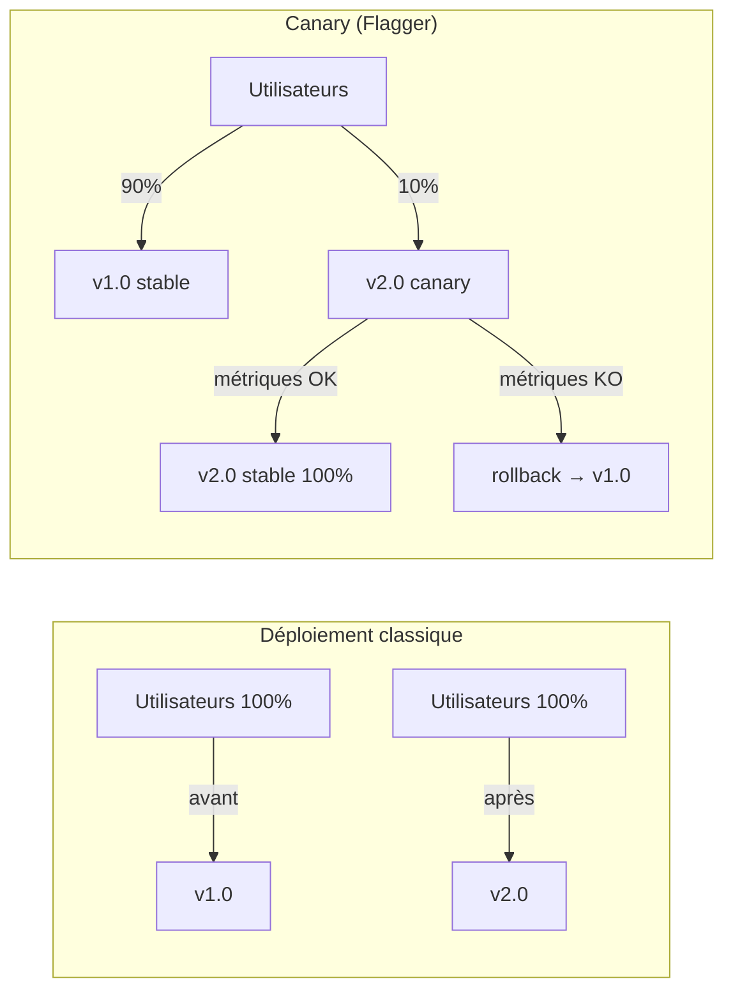

FluxCD déploie de nouvelles versions instantanément : l'ancienne version est remplacée par la nouvelle en quelques secondes. Pour les applications critiques, ce risque est inacceptable. [Flagger](https://flagger.app/) résout ce problème en implémentant le **progressive delivery** — le trafic est migré progressivement vers la nouvelle version, avec rollback automatique si les métriques se dégradent.

## Qu'est-ce que le progressive delivery ?

Au lieu de basculer 100% du trafic vers la nouvelle version immédiatement :



Flagger envoie progressivement du trafic vers la nouvelle version (canary) par incréments configurables, vérifie les métriques à chaque étape, et rollback automatiquement si quelque chose se dégrade.

## Installer Flagger via FluxCD

Flagger nécessite un service mesh ou un ingress controller pour le traffic splitting. Dans ce guide, nous utilisons **Nginx Ingress Controller** — le plus simple à configurer.

Ajoutez les sources Helm :

```yaml
---
# infrastructure/sources/flagger.yaml
apiVersion: source.toolkit.fluxcd.io/v1
kind: HelmRepository
metadata:
  name: flagger
  namespace: flux-system
spec:
  interval: 1h
  url: https://flagger.app
```

```yaml
---
# infrastructure/sources/ingress-nginx.yaml
apiVersion: source.toolkit.fluxcd.io/v1
kind: HelmRepository
metadata:
  name: ingress-nginx
  namespace: flux-system
spec:
  interval: 1h
  url: https://kubernetes.github.io/ingress-nginx
```

Déployez Nginx Ingress Controller :

```yaml
---
# infrastructure/ingress-nginx/namespace.yaml
apiVersion: v1
kind: Namespace
metadata:
  name: ingress-nginx
```

```yaml
---
# infrastructure/ingress-nginx/helmrelease.yaml
apiVersion: helm.toolkit.fluxcd.io/v2
kind: HelmRelease
metadata:
  name: ingress-nginx
  namespace: ingress-nginx
spec:
  interval: 1h
  chart:
    spec:
      chart: ingress-nginx
      version: ">=4.0.0"
      sourceRef:
        kind: HelmRepository
        name: ingress-nginx
        namespace: flux-system
  values:
    controller:
      metrics:
        enabled: true
```

Déployez Flagger :

```yaml
---
# infrastructure/flagger/namespace.yaml
apiVersion: v1
kind: Namespace
metadata:
  name: flagger-system
```

```yaml
---
# infrastructure/flagger/helmrelease.yaml
apiVersion: helm.toolkit.fluxcd.io/v2
kind: HelmRelease
metadata:
  name: flagger
  namespace: flagger-system
spec:
  interval: 1h
  dependsOn:
    - name: ingress-nginx
      namespace: ingress-nginx
  chart:
    spec:
      chart: flagger
      version: ">=1.0.0"
      sourceRef:
        kind: HelmRepository
        name: flagger
        namespace: flux-system
  values:
    meshProvider: nginx
    metricsServer: http://kube-prometheus-stack-prometheus.monitoring:9090
```

Committez tout cela et laissez FluxCD déployer.

## Configurer un Canary pour Podinfo

La ressource `Canary` de Flagger décrit la stratégie de déploiement progressif :

```yaml
---
# apps/base/podinfo/canary.yaml
apiVersion: flagger.app/v1beta1
kind: Canary
metadata:
  name: podinfo
  namespace: podinfo-staging
spec:
  targetRef:
    apiVersion: apps/v1
    kind: Deployment
    name: podinfo

  progressDeadlineSeconds: 120

  service:
    port: 9898
    targetPort: 9898
    ingress:
      annotations:
        kubernetes.io/ingress.class: nginx

  analysis:
    interval: 30s # vérification des métriques toutes les 30s
    threshold: 5 # 5 vérifications échouées → rollback
    maxWeight: 50 # maximum 50% du trafic vers le canary
    stepWeight: 10 # incrément de 10% à chaque étape

    metrics:
      - name: request-success-rate
        thresholdRange:
          min: 99 # rollback si le taux de succès passe sous 99%
        interval: 1m

      - name: request-duration
        thresholdRange:
          max: 500 # rollback si la latence P99 dépasse 500ms
        interval: 1m

    webhooks:
      - name: load-test
        url: http://flagger-loadtester.flagger-system/
        timeout: 5s
        metadata:
          cmd: "hey -z 1m -q 10 -c 2 http://podinfo-canary.podinfo-staging:9898/"
```

Flagger crée automatiquement :

- Un Deployment `podinfo-primary` (stable)
- Un Deployment `podinfo-canary` (nouvelle version)
- Un Service `podinfo-primary` et `podinfo-canary`
- Les règles Ingress pour le traffic splitting

## Installer le load tester Flagger

Le load tester génère du trafic pendant l'analyse canary — indispensable pour avoir des métriques significatives :

```yaml
---
# infrastructure/flagger/loadtester.yaml
apiVersion: helm.toolkit.fluxcd.io/v2
kind: HelmRelease
metadata:
  name: flagger-loadtester
  namespace: flagger-system
spec:
  interval: 1h
  chart:
    spec:
      chart: loadtester
      sourceRef:
        kind: HelmRepository
        name: flagger
        namespace: flux-system
```

## Observer un déploiement canary

Déclenchez un déploiement en modifiant la version de Podinfo dans votre HelmRelease. Flagger intercepte le rollout et le rend progressif.

Observez l'avancement en temps réel :

```bash
watch kubectl get canary podinfo -n podinfo-staging
```

```text
NAME      STATUS        WEIGHT  LASTTRANSITIONTIME
podinfo   Progressing   10      2026-04-24T10:00:30Z
podinfo   Progressing   20      2026-04-24T10:01:00Z
podinfo   Progressing   30      2026-04-24T10:01:30Z
podinfo   Progressing   40      2026-04-24T10:02:00Z
podinfo   Progressing   50      2026-04-24T10:02:30Z
podinfo   Succeeded     0       2026-04-24T10:03:00Z
```

Les logs Flagger donnent le détail des métriques à chaque étape :

```bash
kubectl logs -n flagger-system deploy/flagger --tail=30
```

## Simuler un rollback automatique

Pour déclencher un rollback, déployez une version de Podinfo qui génère des erreurs. Vous pouvez configurer Podinfo pour retourner des erreurs HTTP :

```yaml
values:
  faultInjection:
    delay:
      value: 2000 # 2 secondes de latence — dépasse le threshold de 500ms
```

Flagger détecte la dégradation des métriques après quelques vérifications et rollback automatiquement vers la version stable :

```text
NAME      STATUS    WEIGHT  LASTTRANSITIONTIME
podinfo   Failed    0       2026-04-24T10:05:00Z
```

```bash
kubectl describe canary podinfo -n podinfo-staging | grep -A5 "Events:"
# Warning  Synced  Canary failed! Scaling down podinfo.podinfo-staging
```

> **Mise en pratique** : Modifiez le Canary pour utiliser un incrément de 20% et un maximum de 60%, puis observez la différence de vitesse de déploiement.

<details>
<summary>Solution</summary>

Modifiez `apps/base/podinfo/canary.yaml` :

```yaml
analysis:
  interval: 30s
  threshold: 5
  maxWeight: 60 # jusqu'à 60% du trafic sur le canary
  stepWeight: 20 # incrément de 20% (plus rapide)
```

Avec ces paramètres, le déploiement progresse en 3 étapes (20% → 40% → 60%) puis bascule à 100% si toutes les métriques sont OK — au lieu de 5 étapes avec les paramètres originaux.

```bash
git add apps/base/podinfo/canary.yaml
git commit -m "chore(canary): increase step weight to 20%, max 60%"
git push
```

Déclenchez un déploiement (changez le message Podinfo) et observez :

```bash
watch kubectl get canary podinfo -n podinfo-staging
```

```text
WEIGHT  STATUS
20      Progressing
40      Progressing
60      Progressing
0       Succeeded     (100% basculé vers primary)
```

Le déploiement est environ 2x plus rapide, mais avec moins de granularité de contrôle.

**Pour choisir les bons paramètres** :

- `stepWeight` faible + `maxWeight` élevé = déploiement lent mais contrôlé (recommandé pour production)
- `stepWeight` élevé + `maxWeight` élevé = déploiement rapide (adapté à staging)
- `threshold` élevé = plus de tolérance aux métriques dégradées avant rollback

</details>
